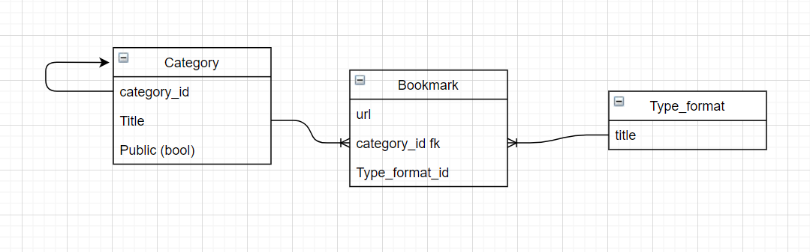

# Bookmark 

The present project involves the implementations bookmark management by categories and types

## Table of Contents

* [Ruby & Rails version](#ruby---rails-version)
* [Ruby & Rails Gems](#ruby---rails-gems)
* [Defining the models](#defining-the-models)
* [Endpoint the Category](#Endpoint-the-Category)
    
## Ruby & Rails version

* ruby '2.5.3'
* gem 'rails', '~> 5.2.6'

## Ruby & Rails Gems

```ruby
gem "faker", "~> 2.19"
gem "chartkick", "~> 4.0"
gem "bootstrap", "~> 5.1"
gem "jquery-rails", "~> 4.4"
```

## Defining the models



## Endpoint the Category

to access the endpoint with the category data, where you indicate subcategories and bookmarks. You must enter the following link, finished in :id :

```console
http://localhost:3000/api/category/1
```